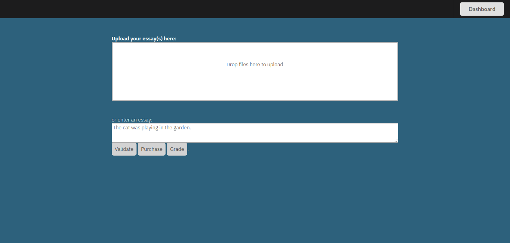

# EDUAI
This is the code for "EDUAI" by Parth Aggarwal as an initiative for transforming education.

## Overview 

It's the code for EDUAI, a tool for teacher that automatically grades and validates essays. In order to validate essays, it uses the copyleaks API to check for plagiarism. It also uses a modified version of GPT-2 to detect the likelihood that the text was real or fake. Then it outputs a validation score using these 2 scores. In order to grade the essay, it uses a neural network model trained on the automatic essay grading dataset on Kaggle found here https://www.kaggle.com/c/asap-aes/data .

## Credits

Credits for the base repository go to [this](https://github.com/HendrikStrobelt/detecting-fake-text/) academic team. Credits for the other tools go to Google, Stripe, and OpenAI. 

## Call for Pull Requests

Scope of Improvement

- Finish implementing the CopyLeaks API
- Create a more accurate version of a validation score that uses the CopyLeaks API score + the GPT-2 real/fake score. Display it to the screen when computed.
- Fix the Tensorflow.js integration, such that its using a pretrained model on the Kaggle automatic essay scoring data, instead ot the default model its using right now. Display the score to the screen accordingly.
- Redesign the app so it looks even more professional (UI elements)

## Dependencies

- Flask
- GPT-2 model
- D3.js
- Stripe
- Firebase
- Copyleaks API
- 

## Quickstart

Install dependencies for Python >3.6 :

```bash
pip install -r requirements.txt
```

run server for `gpt-2-small`:

```bash
python server.py

```

the demo instance runs now at [http://localhost:5001/client/index.html](http://localhost:5001/client/index.html)

## Run the BERT server

start the server for `BERT`:
```bash
python server.py --model BERT
```

the instance runs now at [http://localhost:5001/client/index.html?nodemo](http://localhost:5001/client/index.html?nodemo). HINT: we only provide demo texts for `gpt2-small`.


## server.py options

```
usage: server.py [-h] [--model MODEL] [--nodebug NODEBUG] [--address ADDRESS]
                 [--port PORT] [--nocache NOCACHE] [--dir DIR] [--no_cors]

optional arguments:
  -h, --help         show this help message and exit
  --model MODEL		 choose either 'gpt-2-small' (default) or 'BERT' or your own
  --nodebug NODEBUG  server in non-debugging mode
  --port PORT	     port to launch UI and API (default:5001)
  --no_cors          launch API without CORS support (default: False)

```


## Extend backend

The backend defines a number of model api's that can be invoked by the server by starting it with the parameter `--model NAME`. To add a custom model, you need to write your own api in `backend/api.py` and add the decorator `@register_api(name=NAME)`.

Each api needs to be a class that inherits from `AbstractLanguageChecker`, which defines two functions `check_probabilities` and `postprocess`. Please follow the documentation within `api.py` when implementing the class and the functions.


## Extend frontend
the source code for the front-end is in `client/src`.

To modify, installing of node dependencies is necessary:

```bash
cd client/src; npm install; cd ../..
```
re-compilation of front-end:

```bash
> rm -rf client/dist;cd client/src/; npm run build; cd ../..
```

Working Preview:



